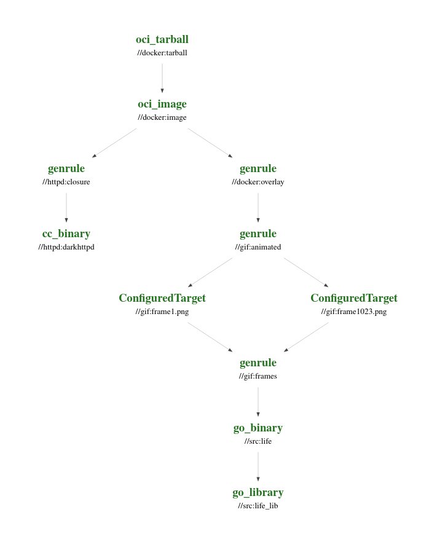

# Debugging Cache Misses in Bazel

A toy repository with a few deliberate issues that introduce nondeterminism and
break caching. To get started:

```
git clone https://github.com/benradf/bazel-community-day-workshop.git
cd bazel-community-day-workshop
./run.sh
```

This will build and run a docker container, which serves an animated gif using
[darkhttpd](https://github.com/emikulic/darkhttpd). You might need to install a
few tools if you don't already have them:

- C++ compiler
- `docker`
- `ffmpeg`

## Target Dependency Graph

The following graph shows how the various targets in the repository depend on
each other:


